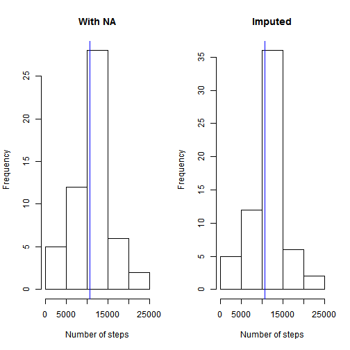
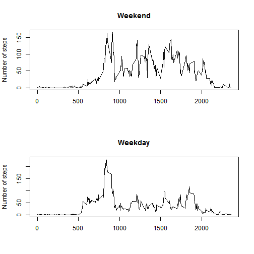

# Reproducible Research - Assignment 1

## Loading and Processing the Data

Load the data 


```r
data <- read.csv("activity.csv", header = TRUE, sep = ",", stringsAsFactors = F, 
        na.strings="NA", colClasses = c("numeric", "Date", "numeric"))
```

Transform the data into a suitable format for analysis


```r
step_total <- data
step_sum <- aggregate(steps ~ date, FUN = sum, data = step_total)
```

## Mean total number of steps taken per day
Make a histogram of the total number of steps taken each day


```r
hist(x = step_sum$steps, xlab = "Number of steps", 
     main = "Histogram of the total number of steps taken each day")
```

 

Calculate and report the mean and median total number of steps taken per day


```r
step_mean <- mean (step_sum$steps, na.rm = TRUE)
step_median <- median (step_sum$step, na.rm = TRUE)
```

```
## Warning: Name partially matched in data frame
```

```r
step_mean
```

```
## [1] 10766
```

```r
step_median
```

```
## [1] 10765
```

## Average daily activity pattern
Make a time series plot of the 5-minute interval and the average number of steps taken, averaged across all days.


```r
step_interval <- aggregate(steps ~ interval, FUN = mean, 
                           data = step_total, na.rm = T)
plot(step_interval$interval, step_interval$steps, data = step_interval, type ="l")
```

```
## Warning: "data" is not a graphical parameter
## Warning: "data" is not a graphical parameter
## Warning: "data" is not a graphical parameter
## Warning: "data" is not a graphical parameter
## Warning: "data" is not a graphical parameter
## Warning: "data" is not a graphical parameter
```

 

Calculate the 5-minute interval, on average across all the days in the dataset, contains the maximum number of steps.


```r
step_interval[which.max(step_interval$steps),]$interval
```

```
## [1] 835
```
## Imputing missing values
Calculate and report the total number of missing values in the dataset.


```r
sum(is.na(data$steps))
```

```
## [1] 2304
```

We can fill all of the missing values in the dataset with the mean of the corresponding interval.


```r
imputed_data <- data
for (i in 1:nrow(imputed_data)) {
    if (is.na(imputed_data$steps[i])) {
        index_imputed <- which(step_interval$interval == imputed_data[i, ]$interval)
        imputed_data$steps[i] <- step_interval[index_imputed, ]$steps
    }
}
```

Make a histogram of the total number of steps taken each day 

```r
imputed_data_sum <- aggregate(steps ~ date, FUN = sum, data = imputed_data, 
        na.action = na.pass)

hist(x = imputed_data_sum$steps, xlab = "Number of steps", 
        main = "Histogram of the total number of steps taken each day")
```

 

Calculate and report the mean and median total number of steps taken per day. 


```r
imputed_step_mean <- mean(imputed_data_sum$steps, na.rm = TRUE)
imputed_step_median <- median(imputed_data_sum$steps, na.rm = TRUE)
imputed_step_mean
```

```
## [1] 10766
```

```r
imputed_step_median
```

```
## [1] 10766
```
The step mean is the same to the first part of the assignment. However, the median is a little different (10766 compared to 10765). The imputed data make the skew of the distribution shifted to the right. 

```r
par(mfrow=c(1,2))
hist(x = step_sum$steps, xlab = "Number of steps", main = "With NA")
abline(v = step_mean, col = "red")
abline(v = step_median, col = "blue")
hist(x = imputed_data_sum$steps, xlab = "Number of steps", main = "Imputed")
abline(v = imputed_step_mean, col = "red")
abline(v = imputed_step_median, col = "blue")
```

 

## Differences in activity patterns between weekdays and weekends

Create a new factor variable in the dataset with two levels - "weekday" and "weekend" indicating whether a given date is a weekday or weekend day.


```r
imputed_data$weekday <- as.factor(weekdays(imputed_data$date))
weekend <- subset(imputed_data, weekday %in% c("Saturday", "Sunday"))
weekday <- subset(imputed_data, !weekday %in% c("Saturday", "Sunday"))
weekend_step <- aggregate (steps ~ interval, FUN = mean, data = weekend)
weekday_step <- aggregate (steps ~ interval, FUN = mean, data = weekday)
```

Make a panel plot containing a time series plot of the 5-minute interval and the average number of steps taken, averaged across all weekday days or weekend days.


```r
par(mfrow=c(2,1))

plot(weekend_step$interval, weekend_step$steps, type = "l", xlab = "", ylab = "Number of steps", main = "Weekend")

plot(weekday_step$interval, weekday_step$steps, type = "l", xlab = "", ylab = "Number of steps", main = "Weekday")
```

 


